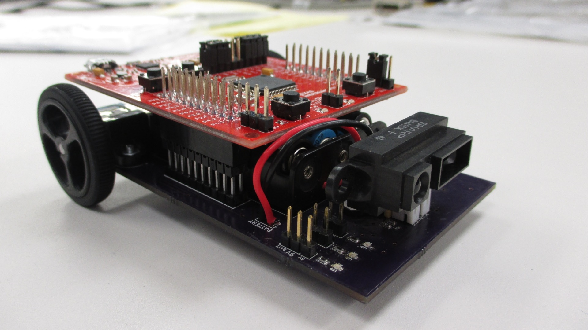

+++
title="BoosterBot"
date=2014-08-01
transparent=true
+++

A BoosterPack to turn a TI LaunchPad into a robot!

## Features
 * Distance sensing with a Sharp IR distance sensor
 * Line tracking with five QRE1113 reflectance sensors
 * Differential steering with Micro Metal Gearmotors
 * Built-in Power with a 3xAAA battery holder
 * FuelTank BoosterPack support for a larger capacity battery with USB charging
 * Servo Header supports one servo motor

## Compatibility
BoosterBot adheres to the 40-pin BoosterPack standard, meaning it should be compatible with most 40-pin LaunchPads.

It has been tested with the MSP430F5529 LaunchPad.

## Software Support
BoosterBot supports Arduino using the Energia library. There are code examples for line tracking, distance tracking, and wireless communication using Bluetooth and the AIR BoosterPack to get you started.

## Links

[GitHub](https://github.com/Hylian/BoosterBot)
