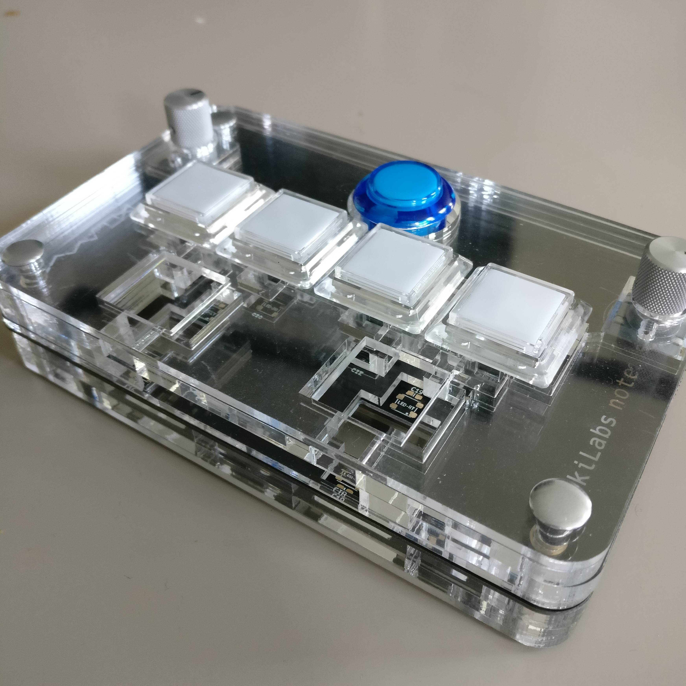
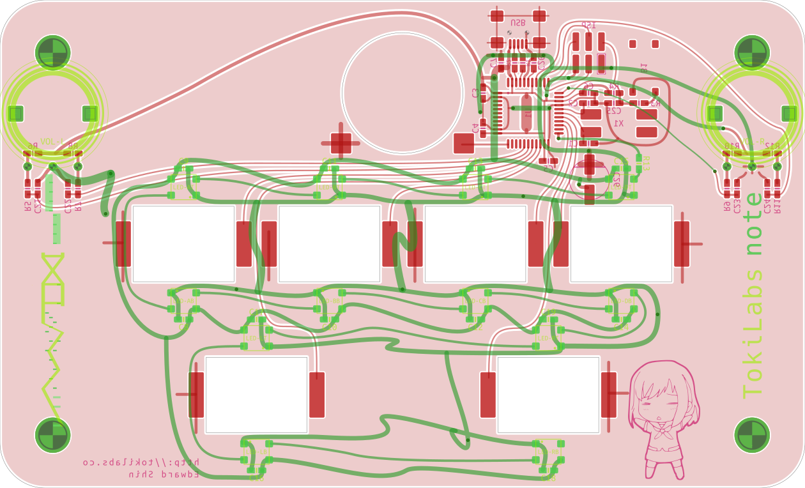
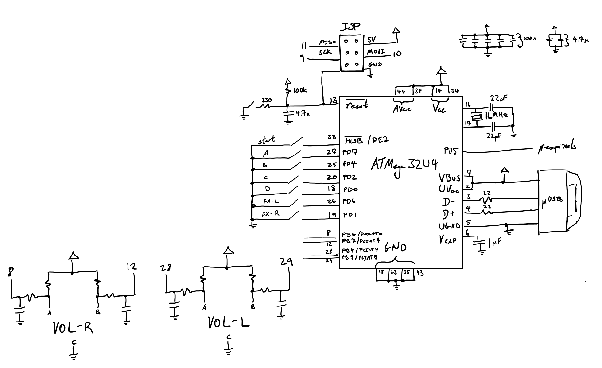

+++
title="Tokilabs Note"
date=2017-05-01
transparent=true
+++

A small controller for the game Sound Voltex.

The PCB was designed with Boldport's [PCBmodE](https://github.com/boldport/pcbmode).

## Features
 * ATmega32U4
 * RGB button backlighing using Adafruit Neopixels
 * Rotary encoders
 * Sanwa arcade buttons
 * Laser-cut acrylic enclosure
 * Rubber feet inserts
 * 160 x 92 mm

